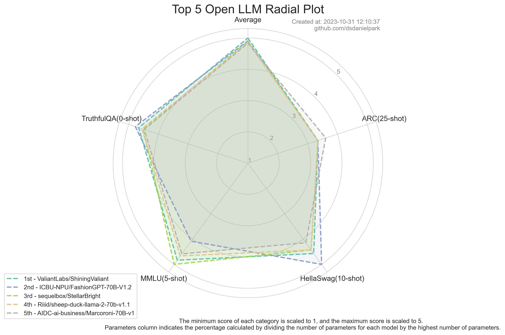
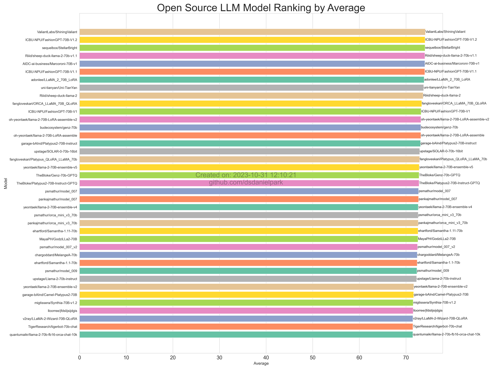
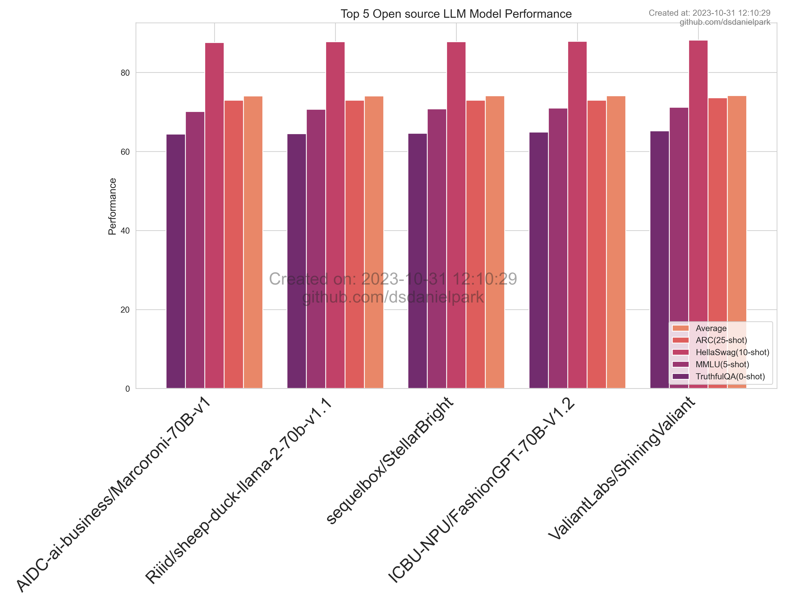
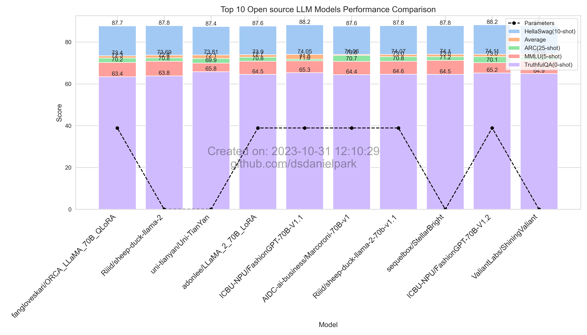
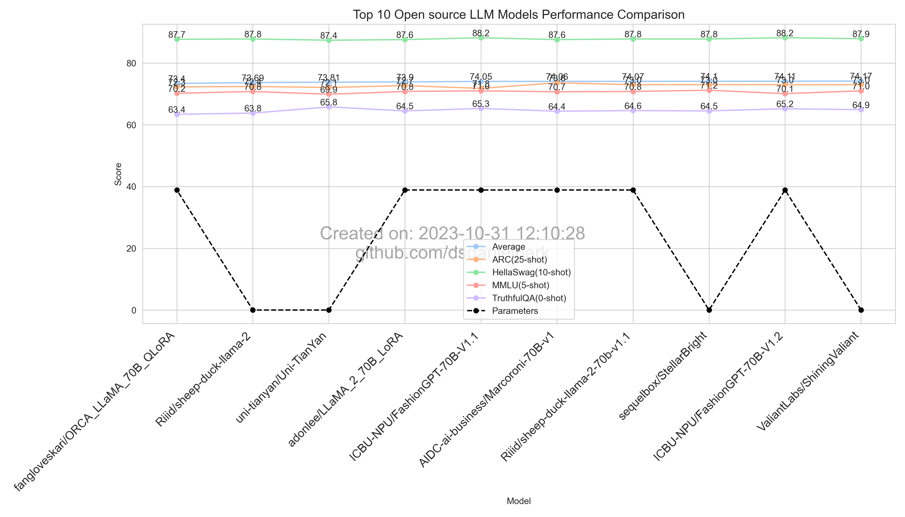
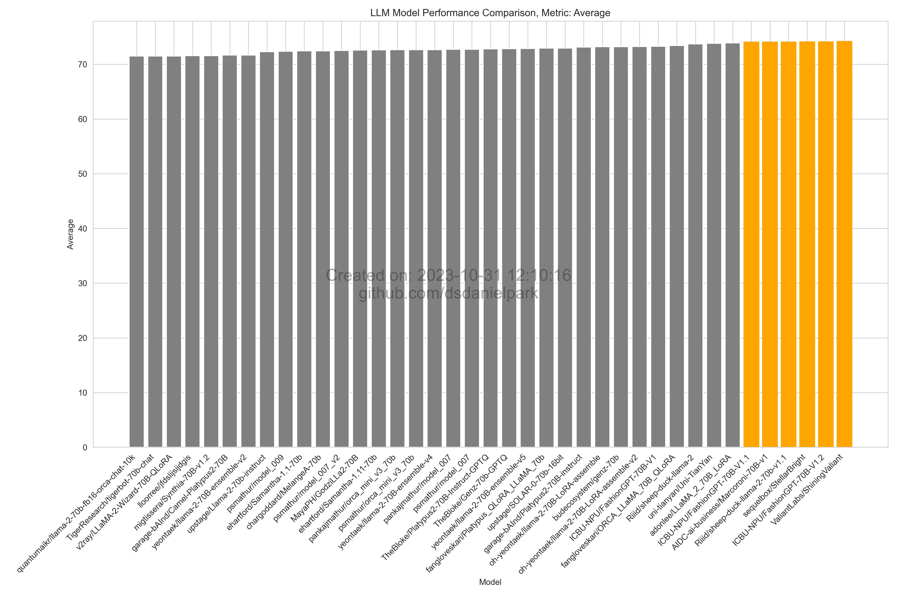

Development Status :: 5 - Production/Stable <br>
*Copyright (c) 2023 MinWoo Park*


<br><br> 

***

<br><br> 


## Updates officially ceased on November 13, 2023.
The updates for the Open LLM LeaderBoard Report(This Repository) will officially cease on November 13, 2023. Due to concerns of contamination and leaks in the test dataset, I have determined that the rankings on Hugging Face's Open LLM Leaderboard can no longer be fully trusted. Users referring to the Open LLM Leaderboard should now carefully assess not only the rankings of models but also whether models have artificially boosted benchmark scores using contaminated training data. Additionally, it is advisable to consider benchmark datasets tailored for different purposes and to conduct qualitative evaluations as well.

Nevertheless, Hugging Face's Open LLM LeaderBoard, with its free GPU instances, can still provide a rough estimate of model performance for many users and serve as one aspect of quantitative validation. We appreciate Hugging Face for their contributions.

Although updates will no longer be carried out, the code used to generate the corresponding plots remains valid, allowing you to configure and analyze the data as needed.

<br><br> 

***

<br><br> 


# Open LLM Leaderboard Report
#### Latest update: 20231031
This repository offers visualizations that showcase the performance of open-source Large Language Models (LLMs), based on evaluation metrics sourced from Hugging Face's Open-LLM-Leaderboard. 


## Source data
You can refer to this [CSV file](https://github.com/dsdanielpark/Open-LLM-Leaderboard-Report/blob/main/assets/20231031/20231031.csv) for the underlying data used for visualization. Raw data is 2d-list formatted [JSON file](https://github.com/dsdanielpark/Open-LLM-Leaderboard-Report/blob/main/data/20231031.json). You can find all images and back data at [assets folder](https://github.com/dsdanielpark/open-llm-leaderboard-report/tree/main/assets).

## Revision
[Discussion and analysis during the revision](https://github.com/dsdanielpark/Open-LLM-Leaderboard-Report/blob/main/REVISION.md)

## Run
Set using [`config.py`](https://github.com/dsdanielpark/open-llm-leaderboard-report/blob/main/config.py)
```
git clone https://github.com/dsdanielpark/open_llm_leaderboard
cd open_llm_leaderboard
```
```
python main.py
```
## Top 5 Summary



##  Total Summary

- Parameters: The largest parameter model achieved so far has been converted to 100 for percentage representation. When there is no parameter information in model name, it is displayed as 0, making the graph appear to suddenly connect to 0.

## Average Ranking


## What is Open-LLM-Leaderboard?
https://huggingface.co/spaces/HuggingFaceH4/open_llm_leaderboard

The [Open LLM Leaderboard](https://huggingface.co/spaces/HuggingFaceH4/open_llm_leaderboard) tracks, ranks, and evaluates large language models and chatbots. It evaluates models based on benchmarks from the Eleuther AI Language Model Evaluation Harness, covering science questions, commonsense inference, multitask accuracy, and truthfulness in generating answers. 

The benchmarks aim to test reasoning and general knowledge in different fields using 0-shot and few-shot settings.

Evaluation is performed against 4 popular benchmarks:
- [AI2 Reasoning Challenge (25-shot)](https://allenai.org/data/arc) - a set of grade-school science questions.
- [HellaSwag (10-shot)](https://paperswithcode.com/dataset/hellaswag) - a test of commonsense inference, which is easy for humans (~95%) but challenging for SOTA models.
- [MMLU (5-shot)](https://paperswithcode.com/sota/multi-task-language-understanding-on-mmlu) - a test to measure a text model’s multitask accuracy. The test covers 57 tasks including elementary mathematics, US history, computer science, law, and more.
- [TruthfulQA (0-shot)](https://paperswithcode.com/dataset/truthfulqa) - a benchmark to measure whether a language model is truthful in generating answers to questions.

It is chosed benchmarks as they test a variety of reasoning and general knowledge across a wide variety of fields in 0-shot and few-shot settings.

## Top 5


## Top 10



## Performance by Metric

### Average



### HellaSwag (10-shot)
.png)
.png)

### MMLU (5-shot)
.png)
.png)

### AI2 Reasoning Challenge (25-shot)
.png)
.png)

### TruthfulQA (0-shot)
.png)
.png)

### Parameters
Parameters: The largest parameter model achieved so far has been converted to 100 for percentage representation.


## Citation
```bibtex
@software{Open-LLM-Leaderboard-Report-2023,
  author = {Daniel Park},
  title = {Open-LLM-Leaderboard-Report},
  url = {https://github.com/dsdanielpark/Open-LLM-Leaderboard-Report},
  year = {2023}
}
```


# Reference
[1] https://huggingface.co/spaces/HuggingFaceH4/open_llm_leaderboard

