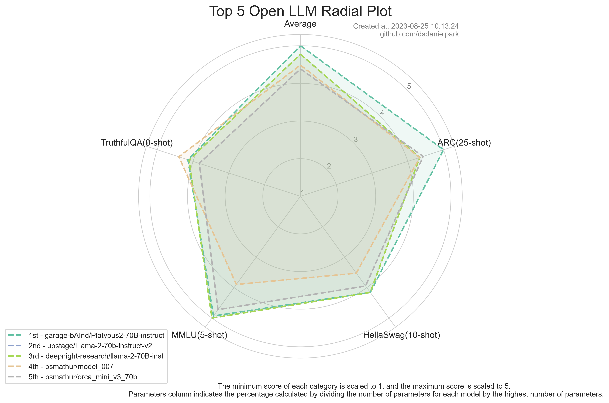
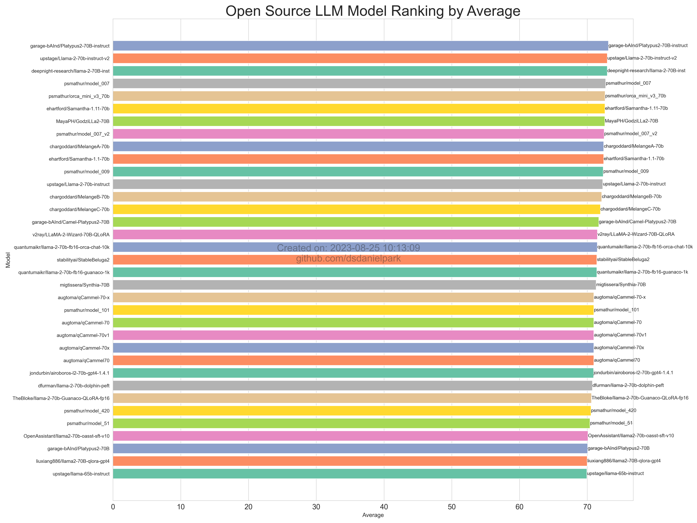
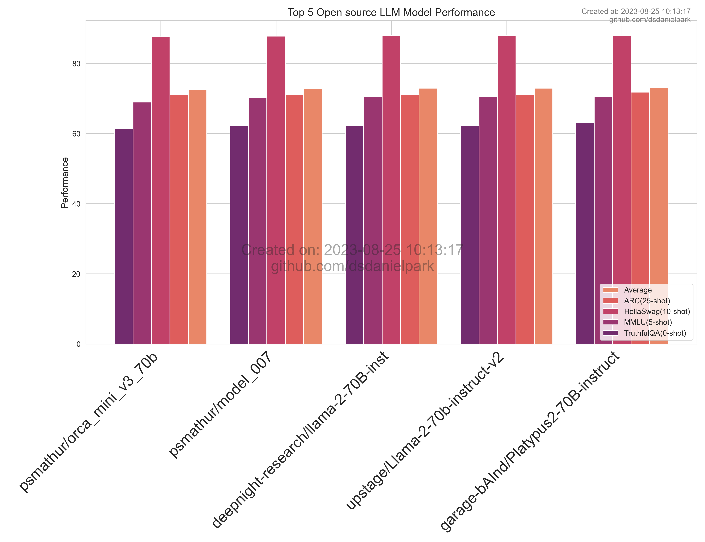
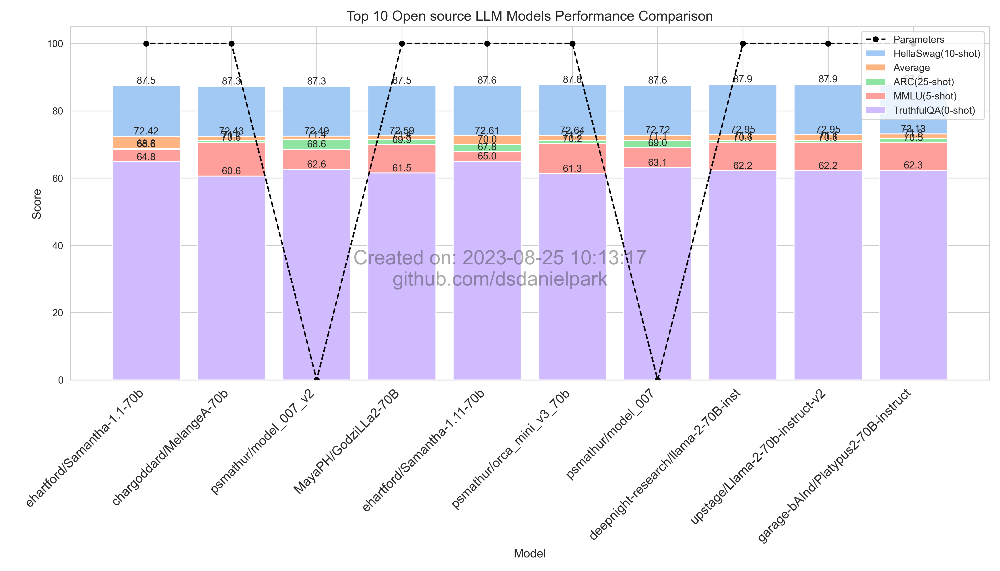
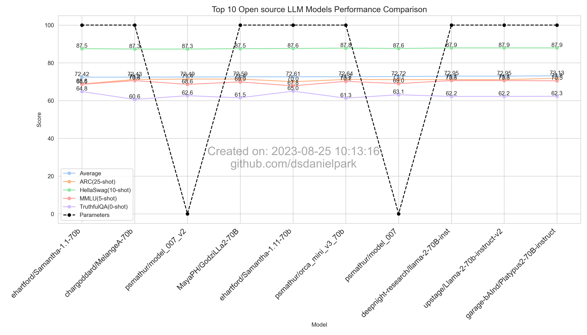
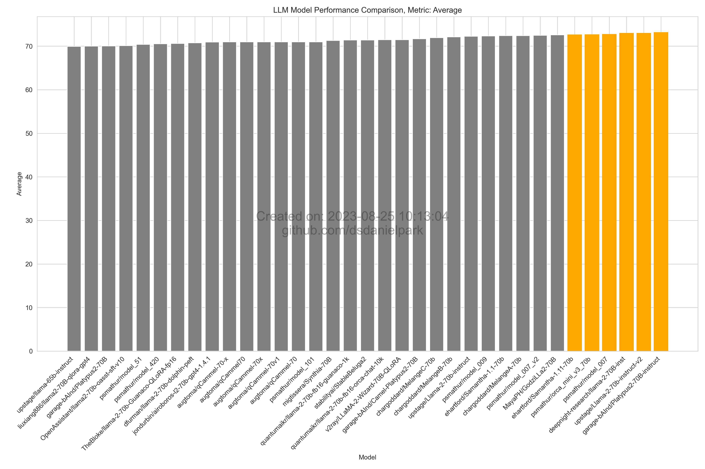

Development Status :: 5 - Production/Stable <br>
*Copyright (c) 2023 MinWoo Park*


# Open LLM Leaderboard Report
#### Latest update: 20230825
This repository offers weekly visualizations that showcase the performance of open-source Large Language Models (LLMs), based on evaluation metrics sourced from Hugging Face's Open-LLM-Leaderboard. The visualizations are refreshed weekly to ensure up-to-date information.

## Source data
You can refer to this [CSV file](https://github.com/dsdanielpark/Open-LLM-Leaderboard-Report/blob/main/assets/20230825/20230825.csv) for the underlying data used for visualization. Raw data is 2d-list formatted [JSON file](https://github.com/dsdanielpark/Open-LLM-Leaderboard-Report/blob/main/data/20230825.json). You can find all images and back data at [assets folder](https://github.com/dsdanielpark/open-llm-leaderboard-report/tree/main/assets).

## Revision
[Revision with Discussion and Analysis](https://github.com/dsdanielpark/Open-LLM-Leaderboard-Report/blob/main/REVISION.md)

## Run
Set using [`config.py`](https://github.com/dsdanielpark/open-llm-leaderboard-report/blob/main/config.py)
```
git clone https://github.com/dsdanielpark/Open-LLM-Leaderboard-Report
cd Open-LLM-Leaderboard-Report
```
```
python main.py
```
## Top 5 Summary



##  Total Summary

- Parameters: The largest parameter model achieved so far has been converted to 100 for percentage representation. When there is no parameter information in model name, it is displayed as 0, making the graph appear to suddenly connect to 0.

## Average Ranking


## What is Open-LLM-Leaderboard?
https://huggingface.co/spaces/HuggingFaceH4/open_llm_leaderboard

The [Open LLM Leaderboard](https://huggingface.co/spaces/HuggingFaceH4/open_llm_leaderboard) tracks, ranks, and evaluates large language models and chatbots. It evaluates models based on benchmarks from the Eleuther AI Language Model Evaluation Harness, covering science questions, commonsense inference, multitask accuracy, and truthfulness in generating answers. 

The benchmarks aim to test reasoning and general knowledge in different fields using 0-shot and few-shot settings.

Evaluation is performed against 4 popular benchmarks:
- [AI2 Reasoning Challenge (25-shot)](https://allenai.org/data/arc) - a set of grade-school science questions.
- [HellaSwag (10-shot)](https://paperswithcode.com/dataset/hellaswag) - a test of commonsense inference, which is easy for humans (~95%) but challenging for SOTA models.
- [MMLU (5-shot)](https://paperswithcode.com/sota/multi-task-language-understanding-on-mmlu) - a test to measure a text model’s multitask accuracy. The test covers 57 tasks including elementary mathematics, US history, computer science, law, and more.
- [TruthfulQA (0-shot)](https://paperswithcode.com/dataset/truthfulqa) - a benchmark to measure whether a language model is truthful in generating answers to questions.

It is chosed benchmarks as they test a variety of reasoning and general knowledge across a wide variety of fields in 0-shot and few-shot settings.

## Top 5


## Top 10



## Performance by Metric

### Average



### HellaSwag (10-shot)
.png)
.png)

### MMLU (5-shot)
.png)
.png)

### AI2 Reasoning Challenge (25-shot)
.png)
.png)

### TruthfulQA (0-shot)
.png)
.png)

### Parameters
Parameters: The largest parameter model achieved so far has been converted to 100 for percentage representation.


## Citation
```bibtex
@software{Open-LLM-Leaderboard-Report-2023,
  author = {Daniel Park},
  title = {Open-LLM-Leaderboard-Report},
  url = {https://github.com/dsdanielpark/Open-LLM-Leaderboard-Report},
  year = {2023}
}
```


# Reference
[1] https://huggingface.co/spaces/HuggingFaceH4/open_llm_leaderboard

