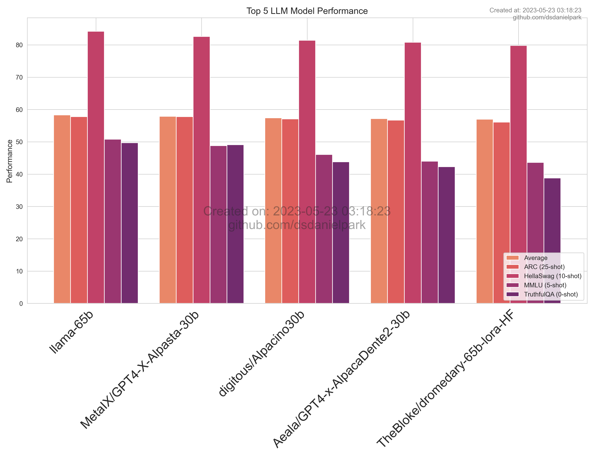
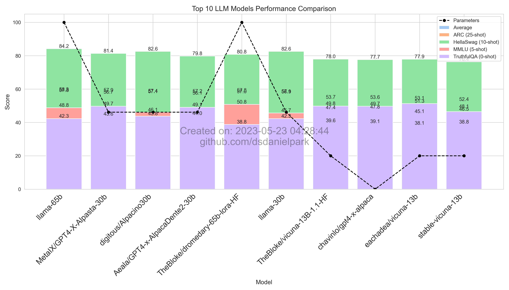
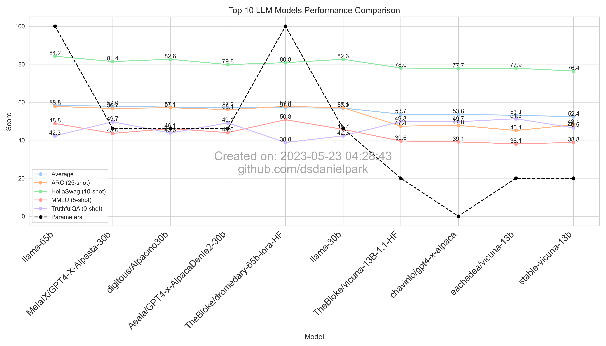
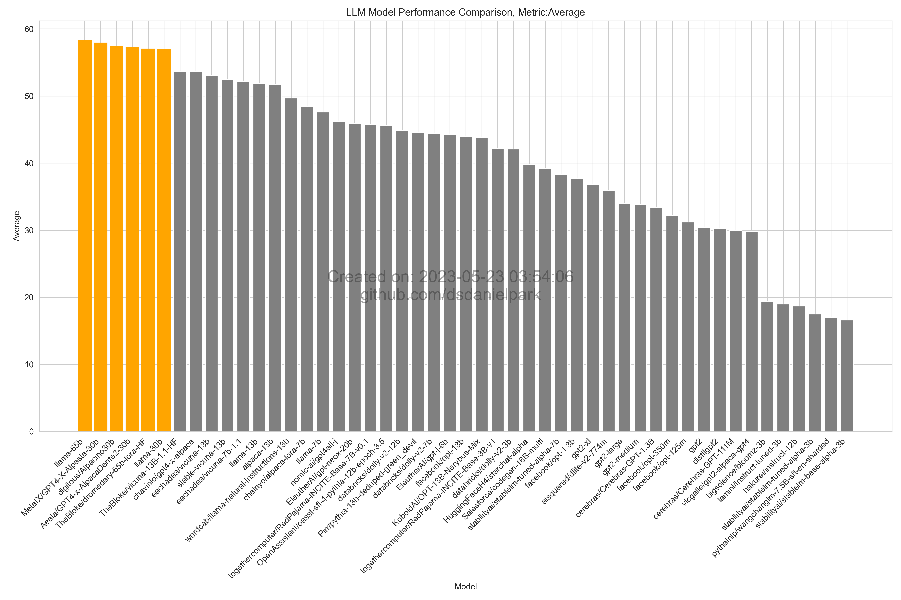
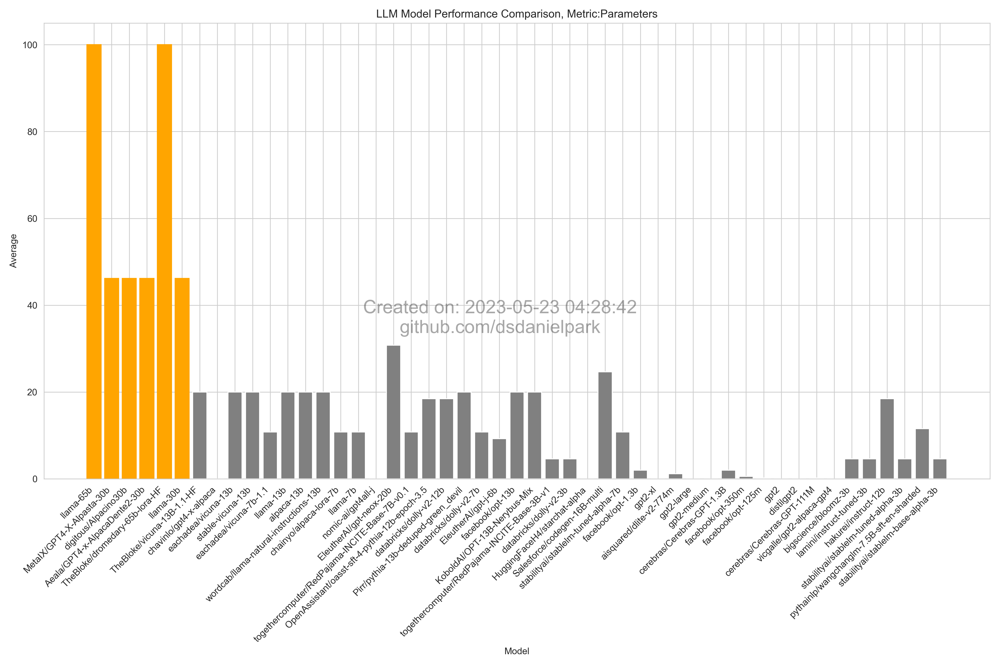

# Open LLM Leaderboard Report (Daily Update)
This repository offers daily visualizations that showcase the performance of open-source Large Language Models (LLMs), based on evaluation metrics sourced from Hugging Face's Open-LLM-Leaderboard. The visualizations are refreshed daily to ensure up-to-date information.

## Source data
You can refer to this [CSV file](https://github.com/dsdanielpark/Open-LLM-Leaderboard-Report/blob/main/assets/20230523/20230523.csv) for the underlying data used for visualization.

##  Summarizing the Performance of All Models

## What is Open-LLM-Leaderboard?
https://huggingface.co/spaces/HuggingFaceH4/open_llm_leaderboard

The [Open LLM Leaderboard](https://huggingface.co/spaces/HuggingFaceH4/open_llm_leaderboard) tracks, ranks, and evaluates large language models and chatbots. It evaluates models based on benchmarks from the Eleuther AI Language Model Evaluation Harness, covering science questions, commonsense inference, multitask accuracy, and truthfulness in generating answers. 

The benchmarks aim to test reasoning and general knowledge in different fields using 0-shot and few-shot settings.

Evaluation is performed against 4 popular benchmarks:
- [AI2 Reasoning Challenge (25-shot)](https://allenai.org/data/arc) - a set of grade-school science questions.
- [HellaSwag (10-shot)](https://paperswithcode.com/dataset/hellaswag) - a test of commonsense inference, which is easy for humans (~95%) but challenging for SOTA models.
- [MMLU (5-shot)](https://paperswithcode.com/sota/multi-task-language-understanding-on-mmlu) - a test to measure a text model’s multitask accuracy. The test covers 57 tasks including elementary mathematics, US history, computer science, law, and more.
- [TruthfulQA (0-shot)](https://paperswithcode.com/dataset/truthfulqa) - a benchmark to measure whether a language model is truthful in generating answers to questions.

It is chosed benchmarks as they test a variety of reasoning and general knowledge across a wide variety of fields in 0-shot and few-shot settings.

## Top 5

## Top 10

## Performance by Metric

### Average

### HellaSwag (10-shot)
.png)

### MMLU (5-shot)
.png)

### AI2 Reasoning Challenge (25-shot)
.png)

### TruthfulQA (0-shot)
.png)

### Parameters

