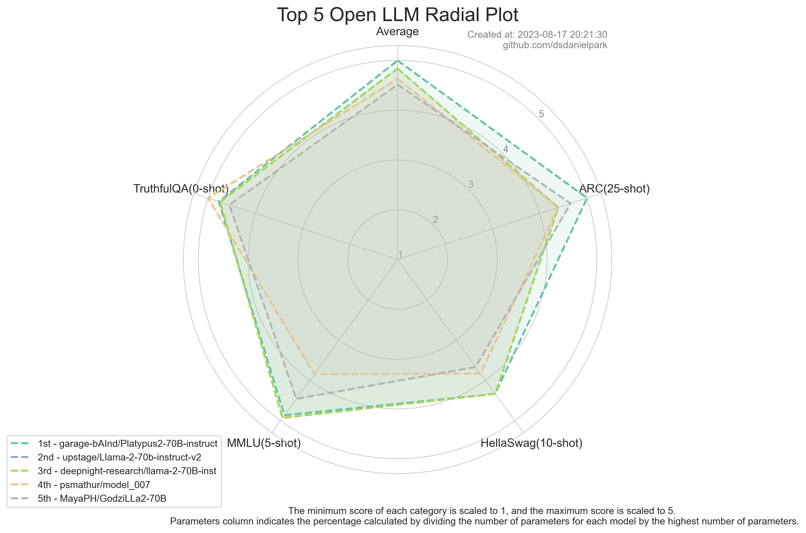
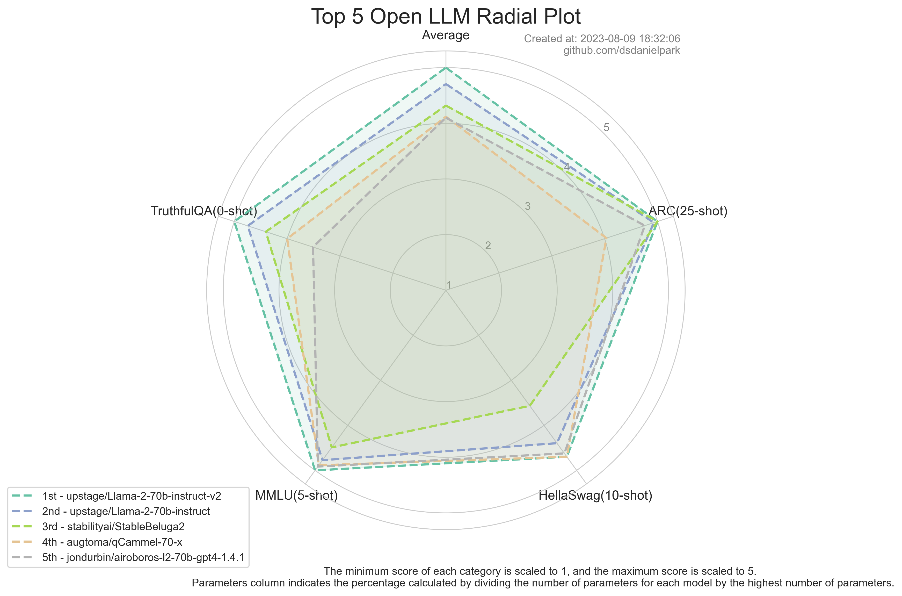
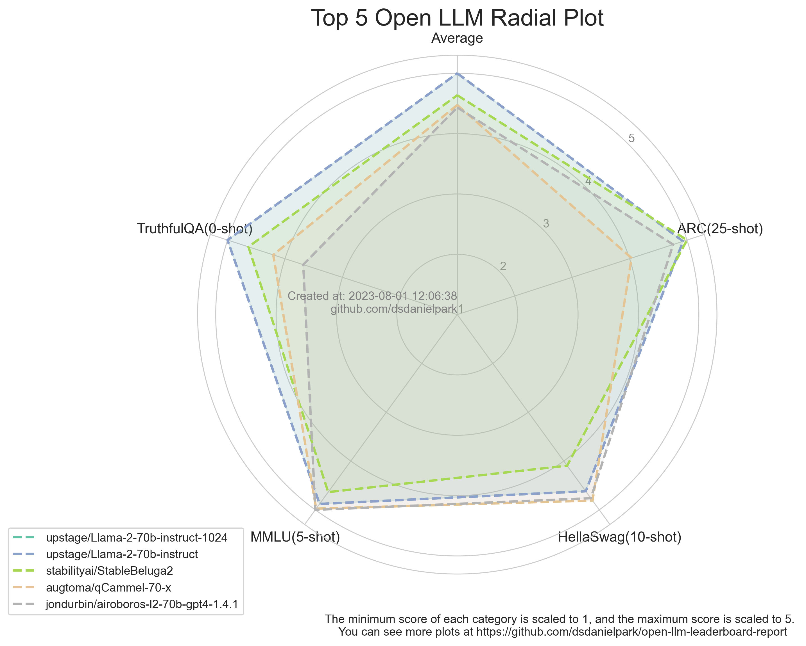
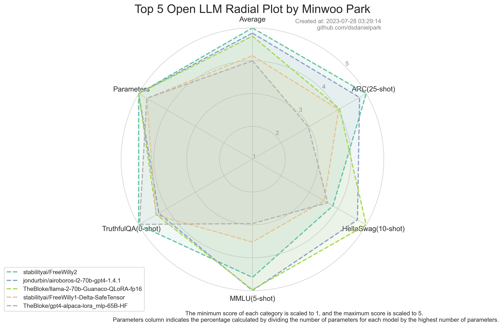
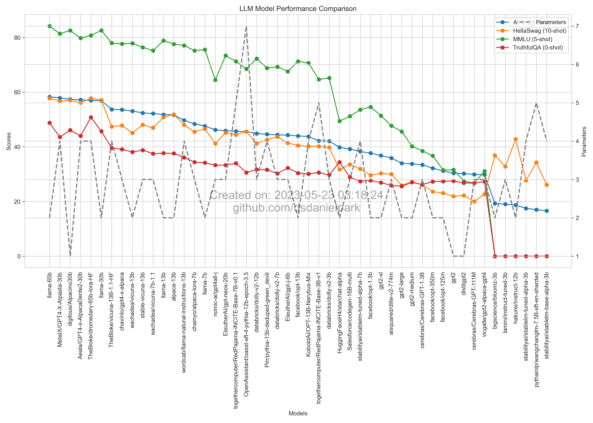

# Open LLM Leaderboard Report Revision

### 2023.08.17
- Instruction Tuning in LLM is an experimental field, and as seen in LLaMa2 Chat, the task of adjusting it to human preferences is also experimental and relies on human evaluation. Many studies are proceeding by selecting record scales (such as in the case of Meta's llama2 chat) and some reliable annotators (see Meta's Self-Alignment with Instruction Back-translation paper).

- Additionally, recently, teams including Meta AI and Platypus have pointed out data contamination in prominent LLM evaluation metrics. Platypus has addressed this contamination, effectively performing QLORA, and claimed the top spot on the open leaderboard.

- While further validation for additional data contamination is needed, this once again demonstrates that the metrics used in open LLM leaderboards can only be auxiliary, and it also points out data contamination in previously tuned LLMs (ranking may be adjusted).

- Furthermore, as some experiments by the UpStage team show, llama1 and llama2 maintain almost the same architecture but have different tuning patterns depending on sequence length. I believe llama2 will become a new fine-tuning field.

- Overall, the current trend is 1) a need for well-curated small datasets, 2) the ability to adjust them for domain-specific needs, and 3) CoT (Chain of Thought), which also requires well-curated small datasets, can derive abstract insights that allow reasoning in unadjusted domains. Some of these aspects have also been mentioned multiple times in papers.

- Additionally, the Meta AI-llama2 team consistently advocates for well-curated, high-quality small datasets and mentions verifying this several times in their paper. Therefore, it seems that the attention to Falcon's large-scale partially curated datasets has diminished.




### 2023.08.09
- Upstage, a Korean team with exceptional members in the field of Kaggle and AI competitions, has achieved remarkable performance using 70B.
- Particularly, a substantial improvement in the overall model can be observed in TruthfulQA, and for qCammel, it demonstrates high scores in MMLU or HellaSwag.
- Overall, both Upstage and StabilityAI seem to employ similar experimental approaches and techniques, and regarding qCammel, further investigation might be necessary.
- As for the project related to Orca, there is no further update or presence on the leaderboard, and it's unclear whether the project has transitioned to closed-source or what has transpired. If anyone has the latest information about Orca, please let me know via email or message.




### 2023.08.01

#### 1. Which one is better, finetuning with a sequence length of 1024 or 2048 in LLaMA1 and LLaMA2? And what are the reasons behind the choice?

Korean company Upstage released models fine-tuned with llama2 using various datasets. They adjusted the sequence length differently compared to fine-tuning llama1, and the results for the next two models are interesting and intriguing.
- [upstage/Llama-2-70b-instruct-1024](https://huggingface.co/upstage/Llama-2-70b-instruct)
- [upstage/llama-30b-instruct-2048](https://huggingface.co/upstage/llama-30b-instruct-2048/discussions/7#64c871d8d11ed5b1e2e0a4c4)


If anyone knows, please let me know on the following [discussion page](https://huggingface.co/upstage/llama-30b-instruct-2048/discussions/7#64c871d8d11ed5b1e2e0a4c4).

[Limerobot](https://huggingface.co/Limerobot)
```
As you may have experienced, I believe Instruction Tuning of LLM is a field of empirical experimentation.

In the case of llama-30b, a higher score was achieved with more Orca style dataset and max_seq_len:2048.

However, for llama-2-70b, in our setting, a smaller size dataset and max_seq_len:1024 scored better.
In fact, it recorded the highest score on our internal leaderboard when only about 50k of a dataset other than Orca dataset was used.

Llama-2-70b tended to overfit faster at max_seq_len:2048, so it performed worse than llama-2-70b-hf. However, we do not plan to do additional experiments to solve this. (Because there is not much benefit in terms of cost)
In conclusion, in our setting, the performance of llama-2-70b was better at max_seq_len:1024, so we chose 1024.

I hope my answer was sufficient for you.

(For reference, according to each model's config.json, max_position_embeddings is 2048 for llma1 and 4096 for llama2.)
```


#### 2. The trade-off of benchmarks.
Based on the observation of the radial chart, the trade-off between benchmark scores appears to be influenced by various factors.The reason for this trade-off in datasets like truthful benchmarks and MMLU benchmarks, which might seem intuitive to have minimal trade-offs, is still unclear and requires further investigation.




### 2023.07.28
- This update is a commit for adding a radial chart of the top 5 open LLMs and is not included in the analysis.
- 


### 2023.07.24

#### 1. *Long Sequence Length is better* <br>
When comparing the models [llama-30b-instruct-2048](https://huggingface.co/upstage/llama-30b-instruct-2048) and [llama-30b-instruct-1024](https://huggingface.co/upstage/llama-30b-instruct), it can be observed that longer sequences, as seen in recent models like long-llama, demonstrate better performance in generative AI. In the context of [long_llama](https://github.com/CStanKonrad/long_llama), the Focused Transformer (FoT) performs better. (https://arxiv.org/abs/2307.03170)

#### 2. *llama2 performs better than llama1.* <br>
Regarding backbone models, llama2 shows better performance, and it is noteworthy that upstage achieved good results with llama1 compared to the top 3 models using llama2. (It is cautiously speculated that upstage might have been retrained with a similar learning strategy based on llama2).


#### 3. *Models with around 30B parameters are cost-effective and those with 65B or more parameters perform better.* <br>
Though not easily definitive, it is roughly estimated that models fine-tuned with llama1 offer better cost-effectiveness with 30B being more efficient in terms of performance compared to 70B. This speculation is based on the fact that stabilityai/FreeWilly2 is a 70B model, while stabilityai/FreeWilly1-Delta-SafeTensor is a 65B model, suggesting that larger parameter size may be advantageous.

#### 4. *The usage of Orca is trending.* <br>
Except for meta's llama2, the Orca dataset was used. Hardware acceleration was performed using the deepspeed library in the case of upstage. The paper "Orca: Progressive Learning from Complex Explanation Traces of GPT-4" introduces Orca, a 13-billion parameter model designed to mimic the reasoning process of large foundation models (LFMs) such as GPT-4. Unlike traditional large language models (LLMs), Orca employs a unique training approach that combines progressive learning and teacher assistance to bridge the capacity gap between smaller student models and their larger counterparts. https://arxiv.org/abs/2306.02707

<br>

- Llama2 from meta ai has been opened, and Stable AI has started its pursuit. Despite many people still harboring suspicions about the reliability of the Open LLM Leaderboard, it remains unchanged without any specific adjustments.
- Furthermore, there are doubts among many about the various LLM models' ability to catch up with GPT-4. However, there are also analyses pointing in different directions, considering OpenAI's revenue and other factors. As a result, the launch of LLM models seems to be proceeding more cautiously than before, rather than actively launching them as previously done.
- Research on code and resource efficiency, as well as package updates, are actively ongoing. Various packages like Langchain and Gradio are receiving frequent updates, and attempts to apply them in different applications are being made.
- Google and OpenAI, along with other companies, are conducting beta releases for service backends. They are efficiently incorporating diverse technologies into generative AI and actively providing free services to analyze user use cases and usage frequency. However, it is uncertain how long these services will remain free.
- Research on significantly increasing attention in the transformer block and exploring more efficient methods such as gzip for certain tasks compared to LLM has surfaced. In other words, there seems to be a shift in focus from just increasing the model size of LLM to researching how to efficiently handle and process the entire LLM token sequence.
- It is expected that soon there may be new models that can perform inference without extensive data training, relying solely on well-organized corpus tokens. However, it might not be until the end of this year or later for such models to become available.
- A package has been released that creates pie charts to visualize the types and frequencies of data on which LLM models are trained, similar to Stanford Alpaca's dataset. While the idea of creating this package was originally considered, the workload with current projects proved too much. Additionally, research on LLM vector databases and other related topics is being actively pursued. Despite starting a project two months ago, you mention not having made substantial progress yet.
- Resource limitations such as GPUs continue to pose challenges. You express a desire for contact from companies or individuals who can provide GPUs with more than 32GB of memory and Linux servers with over 500GB storage through SSH tunneling. Furthermore, you hope to have a free discussion on today's opinions and related content in the following [discussion](https://github.com/dsdanielpark/open-llm-leaderboard-report/discussions/4). You welcome anyone to freely share their thoughts at any time.
- 


#### 2023.07.14
- Regarding the open-source LLM, there haven't been significant changes in terms of the graph and numerical aspects. My opinion remains unchanged that the credibility of the open-source LLM leaderboard, as mentioned on June 29, 2023, cannot be trusted. Therefore, I would like to summarize the community news on recent research and developments related to LLM over the past two weeks, rather than focusing on evaluations based on metrics.
- Recent major updates in the LLM community include the development of easier and faster fine-tuning and inference methods, techniques to minimize memory and resource usage at a low cost, and the creation of packaged solutions for easy componentization.
- In research on model-centric approaches, several papers have emerged focusing on methods to secure maximum attention and tokens. Some interesting service architectures have been presented, unveiling the concept of multiple specialized models working collaboratively rather than relying on a single model with a large number of parameters. It wasn't surprising to observe that Korean responses in ChatGPT are slightly slower compared to English responses, as I had inferred the presence of a translation-specific model. Additionally, I noticed that code-related tasks direct to the davinci-02 model page, suggesting that ChatGPT utilizes different expert models within the service architecture. I believe this is an effective approach. Consequently, I am planning to work on a project called [ko-alpaca-lingo](https://github.com/dsdanielpark/ko-alpaca-lingo), where I fine-tune a translation-specialized LLM using Llama 7b and incorporate the recently announced techniques.
- While exploring the whitelist for Palm2 and examining its functionalities, I pondered over the considerations and trial-and-error experiences that OpenAI had gone through in designing their service architecture. I also wondered about the amount of expertise accumulated as a result. Was there a necessity for Google to operate Bard and Palm2 separately? I would be grateful to hear your opinions on this matter, as I am eager to read and study them carefully.
- Feel free to share your thoughts on [Discussion 2023/07/14](https://github.com/dsdanielpark/open-llm-leaderboard-report/discussions/3).
- 

#### 2023.06.29
- The overall analysis of the open leaderboard has now become less significant. Similar to the previous week, the Falcon model has maintained its dominance, while numerous other models are showing similar performance levels. Additionally, there has been a lot of debate regarding the scores on the open leaderboard. There are doubts raised about the possibility that the Falcon model may have obtained favorable scores through different implementation methods than the original approach. Personally, I believe it is not possible to completely exclude the possibility of such circumstances.
- Qualitative Evaluation Report of LLM https://lmsys.org/blog/2023-05-25-leaderboard/?fbclid=IwAR0r4F4_hCy7gfz-xQ_vgv-t6Acgpr-1kebLa8y8zbMHqBANEY3ofX9uDHg
- HuggingFace's kind explanation for the significant difference between the publicly available MMLU score on LLaMA (0.637) and the MMLU score on the HuggingFace Open LLM Leaderboard (0.488). https://huggingface.co/blog/evaluating-mmlu-leaderboard?fbclid=IwAR0cpAXMMvqynpSIISJl734tTlvk42WYrd23sdsrPQ8xW2f9PF937ndUVNg
- MMLU is a metric in the field of computer science that evaluates the accuracy of LLM (Language Model) by measuring the selection probabilities of LLM for multiple-choice questions in 57 different domains. In a multiple-choice question with four options, a random probability distribution would assign a 25% probability to each option. However, the GPT-3 model has reported an improvement of 20 percentage points over random chance in this regard.
- There has been a debate regarding the MMLU scores between LLAMA and HuggingFace. In summary, the difference in scores arises from the fact that the HELM implementation provided scores based on the selection of options in the multiple-choice questions (as originally proposed), while the Harness implementation based the scores on the tokens generated by the model. This fundamental difference in approach led to significant discrepancies in the scores. The original method focused on the selection of options in the four choices, whereas Harness evaluated the scores based on the entire sentence generated by the model. It is worth noting that solely measuring the reasonability of generated tokens based on factors such as token count or frequency poses limitations. Therefore, personally, I believe it is more reasonable to assess how much the probabilities for the four choices, as proposed in the original approach, have improved over random chance.


#### 2023.06.19

- I have come to the conclusion that the current metrics being used for evaluation cannot be trusted, as I initially suspected. The recent report highlights the reason for the growing gap between the Open LLM community and the private LLM community, such as OpenAI. It suggests that the use of quantitative evaluation metrics that are difficult to accurately assess qualitatively also plays a role in this.
- Developing a good LLM, like those in the private sector, requires sufficient resources and an organization capable of handling legal issues.
- Furthermore, as I initially anticipated, it seems true that the Open LLM leaderboard is tailored towards marketing purposes and aligned with Falcon's release.
- Related Paper: [Exploring the MIT Mathematics and EECS Curriculum Using Large Language Models](https://arxiv.org/abs/2306.08997)


#### 2023.06.10
- The system is currently overheated, with the number of pending models exceeding 400. As a result, the performance of the models is starting to differ by decimal points. However, as initially suspected, the performance metrics may be biased towards Falcon, so it is advisable to use them as rough reference indicators rather than absolute quantitative measures. It has been observed that some models, despite having superior qualitative results, rank lower.
- To alleviate the overheating of the leaderboard, the number of models to be visualized is adjusted to the top 70.


<br>

#### 2023.05.31
- With the addition of several key models and improvements in the performance of large-scale models, the changes in the number of parameters become noticeable.


<br>


#### 2023.05.26
- Although it is difficult to completely dismiss the idea that some datasets or metrics may favor Hugging Face's Falcon, it still provides a good overall estimation of model performance.

<br>


#### 2023.05.23
- It provides a good overall estimation of model performance.

<br>
